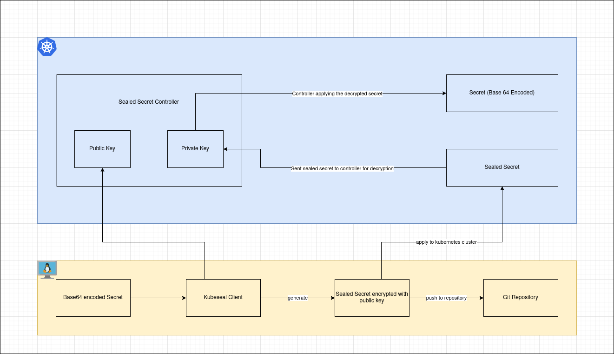

# Bitnami Sealed Secrets

Your Secret can be encrypted into a SealedSecret, which is safe to store in a public repository as long as it is encrypted. Nobody (not even the original author) can decrypt the SealedSecret except the controller running in the target cluster.

## How it works!!!



## Steps to use Sealed Secrets with Kubernetes Cluster:

1. Deploy Bitnami Sealed Secret controller in the Kubernetes Cluster using [Helm Chart .](https://artifacthub.io/packages/helm/bitnami/sealed-secrets)

   ```console
   helm repo add bitnami-labs https://bitnami-labs.github.io/sealed-secrets/

   kubectl create ns sealed-secret

   helm install my-sealed-secrets bitnami-labs/sealed-secrets --version 2.9.0 -n sealed-secret
   ```

2. Install kubeseal client on Linux

   ```console
   wget https://github.com/bitnami-labs/sealed-secrets/releases/download/v0.21.0/kubeseal-0.21.0-linux-amd64.tar.gz

   tar -xvzf kubeseal-0.21.0-linux-amd64.tar.gz kubeseal

   sudo install -m 755 kubeseal /usr/local/bin/kubeseal
   ```

   To check the latest release, visit [Bitnami Official Github Link](https://github.com/bitnami-labs/sealed-secrets/releases)

3. Fetch the public key using kubeseal
   ```console
   kubeseal --fetch-cert --controller-name=sealed-secret-sealed-secrets --controller-namespace=sealed-secret > public-key-cert.pem
   ```
4. Create a sealed secret from existing base64 encoded secret

   ```console
   kubeseal --format=yaml --cert=public-key-cert.pem < secret.yaml > secret-sealed.yaml
   ```

5. Apply the generate sealed secret

   ```console
   kubectl apply -f secret-sealed.yaml
   ```

6. Great!!, Now this secret-sealed.yaml is ready to be pushed on Github
